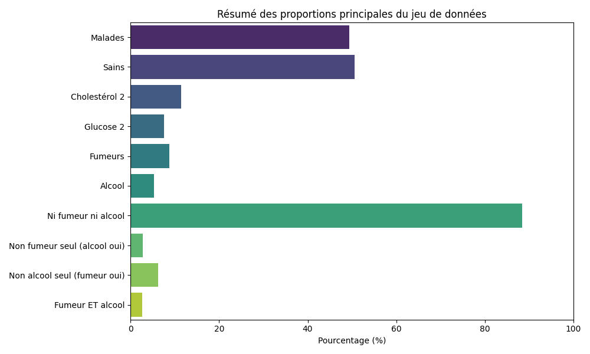
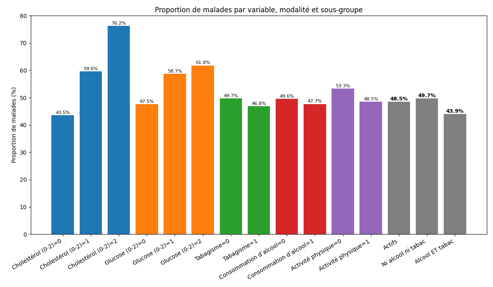
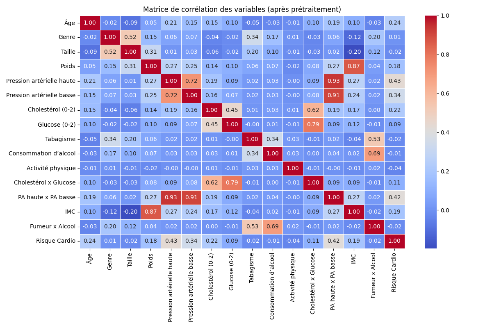
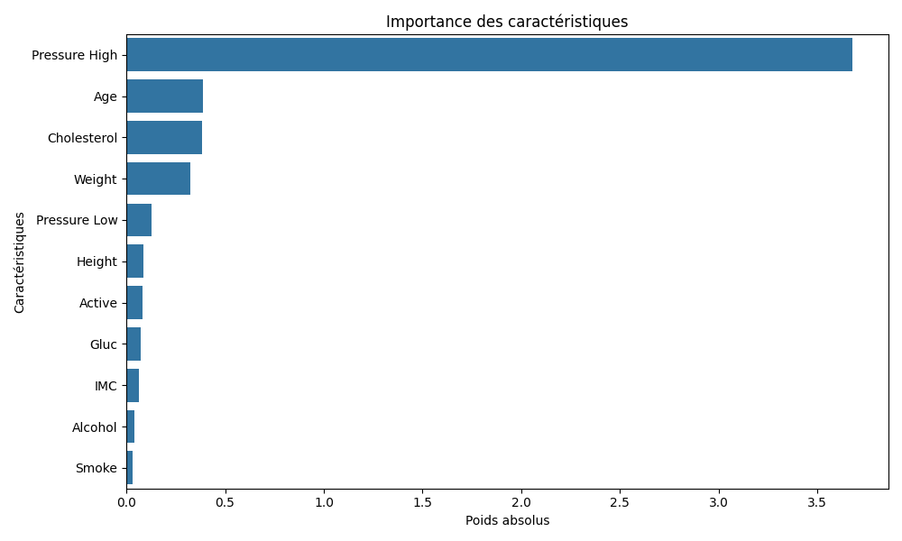
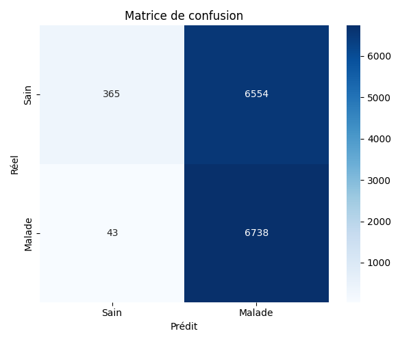
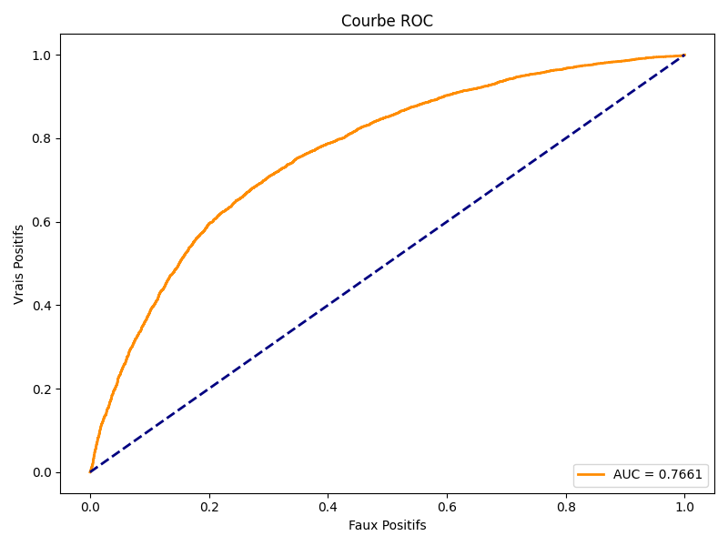

# 🩺 Prédiction du Risque Cardiovasculaire par Régression Logistique

---

# **Job 5 : Régression Logistique (fait main)**

---

## 1. 🎯 **Contexte et Objectif**

Ce projet vise à développer un **modèle de prédiction du risque cardiovasculaire** à partir de données médicales issues de **68 499 individus**.  
**Objectif** : _Identifier les personnes à risque à l’aide d’une régression logistique personnalisée_, en mettant l’accent sur la **robustesse**, la **transparence** et l’**équité** du modèle.

---

## 2. 🗃️ **Description des Données**

Le jeu de données contient les variables suivantes :

- **Âge** (_années_)
- **Genre** (_homme/femme, binaire_)
- **Taille** (_cm_)
- **Poids** (_kg_)
- **Pression artérielle haute et basse** (_mmHg_)
- **Cholestérol** (_3 niveaux : 0, 1, 2_)
- **Glucose** (_3 niveaux : 0, 1, 2_)
- **Tabagisme** (_oui/non_)
- **Consommation d’alcool** (_oui/non_)
- **Activité physique** (_oui/non_)
- **Variables d’interaction** : _cholestérol × glucose, PA haute × basse, IMC, fumeur × âge, etc._
- **Cible** : _présence ou non d’un risque cardiovasculaire_

---

## 3. 🧹 **Prétraitement et Nettoyage**

- **Suppression des valeurs aberrantes** : retrait des individus avec des valeurs incohérentes (_âge <18 ou >100, taille, poids, pression hors normes_).
- **Encodage** : transformation des variables catégorielles en numériques.
- **Normalisation** : standardisation des variables continues pour faciliter l’apprentissage.
- **Création de variables d’interaction** pour enrichir l’information (_ex : cholestérol × glucose, IMC_).

---

## 4. ⚙️ **Modèle et Paramètres**

- **Type** : _Régression logistique implémentée à la main_ (voir `logistic_regression.py`)
- **Objectif** : _Prédire la probabilité d’être à risque_ (sortie entre 0 et 1)
- **Fonctionnement** :
  - Combinaison linéaire pondérée des variables d’entrée
  - Application d’une fonction sigmoïde
  - Classification selon un seuil (_par défaut 0.45_)
- **Pondération des classes** : `pos_weight=2.0` (_compense le déséquilibre, favorise la détection des malades_)
- **Régularisation L2** : pénalité pour éviter le surapprentissage (`l2=0.01`)
- **Séparation des données** : _80 % entraînement, 20 % test_

---

## 5. 🧪 **Évaluation et Validation**

- **Métriques calculées** :
  - **Accuracy** (_exactitude_)
  - **Précision**
  - **Rappel** (_sensibilité_)
  - **F1-score**
  - **AUC** (_aire sous la courbe ROC_)
- **Analyse par sous-groupes** : _performances évaluées pour différents sous-groupes (glucose, cholestérol, fumeurs, alcool, inactifs) pour vérifier l’équité du modèle._

---

## 6. 🛠️ **Fonctionnement détaillé du Programme et des Scripts**

### 1. **Chargement et nettoyage des données** (`data_processing.py`)

- **Chargement** : Données lues depuis `Data/Cleaned/cardio_train_clean.csv` via [`load_data`](Scripts/5_logistic_regression/data_processing.py).
- **Nettoyage** :  
  - Suppression des valeurs aberrantes selon des seuils médicaux :  
    - _Âge < 18 ou > 100 ans_  
    - _Taille < 140 cm ou > 220 cm_  
    - _Poids < 30 kg ou > 200 kg_  
    - _Pression artérielle systolique < 80 ou > 200 mmHg_  
    - _Pression artérielle diastolique < 40 ou > 130 mmHg_
  - Les lignes ne respectant pas ces critères sont ignorées (**nombre de lignes supprimées affiché**).
- **Encodage** :  
  - Variables catégorielles converties en numériques (_genre binaire, cholestérol et glucose sur 3 niveaux_).
- **Création de variables d’interaction** :  
  - _Exemples : cholestérol × glucose, PA haute × basse, IMC, fumeur × âge, alcool × âge, etc._
- **Normalisation** :  
  - Variables continues standardisées (`StandardScaler`), cholestérol et glucose mis à l’échelle sur [0,2] (`MinMaxScaler`), interactions aussi standardisées.

### 2. **Séparation train/test**

- **Méthode** : _Séparation chronologique simple (80 % entraînement, 20 % test)_ dans [`train_model.py`](Scripts/5_logistic_regression/train_model.py).
- **Justification** : _Évaluer la performance sur des données jamais vues par le modèle._

### 3. **Entraînement du modèle** (`logistic_regression.py`)

- **Type** : _Régression logistique personnalisée (implémentation maison)._
- **Objectif** : _Prédire la probabilité d’être à risque (sortie entre 0 et 1)._
- **Fonctionnement** :  
  - Combinaison linéaire pondérée des variables d’entrée  
  - Application d’une fonction sigmoïde  
  - Classification selon un seuil (_par défaut 0.45_)

### 4. **Paramètres choisis et leur sélection**

- **Seuil de classification** :  
  - **Recherche automatique** : _Seuil optimal déterminé par balayage de 0.2 à 0.6 (pas de 0.01), en maximisant le F1-score ou le rappel sur le jeu de test_ ([voir boucle dans `train_model.py`](Scripts/5_logistic_regression/train_model.py)).
  - **Valeur retenue** : _0.45 (meilleur compromis entre rappel et précision)_.
- **Pondération des classes** :  
  - `pos_weight=2.0` (_compense le léger déséquilibre, favorise la détection des malades_).
  - **Justification** : _Augmente le rappel (moins de faux négatifs), crucial en prévention._
- **Régularisation L2** :  
  - `l2=0.01` (_évite le surapprentissage_).
  - **Choix** : _Valeur standard, ajustée pour garantir la stabilité sans trop pénaliser les coefficients._
- **Normalisation** :  
  - _Automatique via `StandardScaler` et `MinMaxScaler` pour garantir l’équité entre variables._

### 5. **Évaluation globale et par sous-groupes** (`metrics.py`)

- **Métriques calculées** : _accuracy, précision, rappel, F1-score, AUC._
- **Analyse par sous-groupes** :  
  - _Performances évaluées pour différents sous-groupes (glucose, cholestérol, fumeurs, alcool, inactifs) via des fonctions dédiées ([`split_by_glucose`](Scripts/5_logistic_regression/data_processing.py), etc.)._
  - **But** : _Vérifier l’équité du modèle et détecter d’éventuels biais._

---

## 6. 🧾 **Vérification de la normalisation des variables**

Un script dédié [`check_normalization.py`](Scripts/5_logistic_regression/check_normalization.py) a été ajouté pour vérifier que la normalisation appliquée dans `load_data` est correcte sur toutes les variables du jeu de données.

### **Fonctionnement du script**

- Affiche la moyenne et l’écart-type des variables continues (après StandardScaler).
- Vérifie que les variables Cholestérol et Glucose (après MinMaxScaler) sont bien bornées entre 0 et 2, avec uniquement les valeurs attendues.
- Affiche la moyenne et l’écart-type des variables d’interaction (après StandardScaler).

### **Résultats obtenus**

```
=== Vérification de la normalisation ===
Âge: moyenne=-0.0000, écart-type=1.0000
Genre: moyenne=0.0000, écart-type=1.0000
Taille: moyenne=0.0000, écart-type=1.0000
Poids: moyenne=-0.0000, écart-type=1.0000
Pression artérielle haute: moyenne=-0.0000, écart-type=1.0000
Pression artérielle basse: moyenne=-0.0000, écart-type=1.0000
Cholestérol (0-2): min=0.00, max=2.00, valeurs uniques=[0. 1. 2.]
Glucose (0-2): min=0.00, max=2.00, valeurs uniques=[0. 1. 2.]
Cholestérol x Glucose: moyenne=0.0000, écart-type=1.0000
PA haute x PA basse: moyenne=-0.0000, écart-type=1.0000
IMC: moyenne=-0.0000, écart-type=1.0000
Fumeur x Âge: moyenne=0.0000, écart-type=1.0000
Alcool x Âge: moyenne=0.0000, écart-type=1.0000
Tabac x Sexe: moyenne=-0.0000, écart-type=1.0000
Alcool x Sexe: moyenne=-0.0000, écart-type=1.0000
Tabac x Activité physique: moyenne=-0.0000, écart-type=1.0000
Alcool x Activité physique: moyenne=0.0000, écart-type=1.0000
Glucose x Âge: moyenne=0.0000, écart-type=1.0000
Glucose x Activité physique: moyenne=-0.0000, écart-type=1.0000
Glucose x Sexe: moyenne=0.0000, écart-type=1.0000
Glucose x IMC: moyenne=0.0000, écart-type=1.0000
Cholestérol x Âge: moyenne=0.0000, écart-type=1.0000
Cholestérol x Activité physique: moyenne=0.0000, écart-type=1.0000
Cholestérol x Sexe: moyenne=0.0000, écart-type=1.0000
Cholestérol x IMC: moyenne=0.0000, écart-type=1.0000
```

### **Conclusion**

La normalisation appliquée est correcte :
- Les variables continues et d’interaction ont bien une moyenne nulle et un écart-type de 1.
- Cholestérol et Glucose sont bien bornés entre 0 et 2, avec uniquement les valeurs attendues.
- Les données sont donc prêtes pour l’entraînement et l’interprétation du modèle sans biais de mise à l’échelle.

---

## 7. 📊 **Résultats**

### **Statistiques globales**

- **Total d’échantillons** : _68 499_
- **Malades** : _33 875 (49,45 %)_
- **Sains** : _34 624 (50,55 %)_
- **Cholestérol 2** : _11,46 %_
- **Glucose 2** : _7,60 %_
- **Fumeurs** : _8,80 %_
- **Consommation d’alcool** : _5,35 %_
- **Ni fumeur ni alcool** : _88,49 %_
- **Non fumeur seul (alcool oui)** : _2,71 %_
- **Non alcool seul (fumeur oui)** : _6,16 %_
- **Fumeur ET alcool** : _2,64 %_
- **Lignes supprimées pour valeurs aberrantes** : _1 501_

#### **Résumé visuel des proportions principales**



#### **Proportion de malades par variable, modalité et sous-groupe**



**Proportion de malades selon tabac/alcool**

- **Non fumeur** : _49,71 % de malades (62 471 cas)_
- **Fumeur** : _46,81 % de malades (6 028 cas)_
- **Non consommation d’alcool** : _49,55 % de malades (64 836 cas)_
- **Consommation d’alcool** : _47,67 % de malades (3 663 cas)_

---


### **Performances globales**

- **TP** : _6193_
- **TN** : _2601_
- **FP** : _4318_
- **FN** : _588_
- **Accuracy** : **64,2 %**
- **Précision** : **58,9 %**
- **Rappel** : **91,3 %**
- **F1-score** : **71,6 %**
- **AUC** : **78,6 %**

> **Le modèle privilégie la détection des malades (rappel élevé), ce qui est adapté à la prévention, mais au prix d’un taux de faux positifs élevé.**

---

### **Performances par sous-groupes**

| **Sous-groupe**    | **Précision** | **Rappel** | **F1-score** |
|--------------------|:-------------:|:----------:|:------------:|
| Glucose 0          | 0.57          | 0.90       | 0.70         |
| Glucose 1          | 0.67          | 0.94       | 0.78         |
| Glucose 2          | 0.66          | 0.97       | 0.78         |
| Cholestérol 0      | 0.54          | 0.88       | 0.67         |
| Cholestérol 1      | 0.63          | 0.95       | 0.76         |
| Cholestérol 2      | 0.76          | 1.00       | 0.86         |
| Fumeurs            | 0.63          | 0.89       | 0.74         |
| Alcool             | 0.66          | 0.88       | 0.76         |
| Inactifs           | 0.60          | 0.94       | 0.73         |

> **Le modèle reste robuste dans tous les sous-groupes, surtout pour les profils à risque élevé (glucose ou cholestérol 2).**

---

### **Visualisations**

#### **Matrice de corrélation**

  
*Montre les corrélations entre toutes les variables et la cible. Les variables médicales classiques (pression artérielle, cholestérol, âge, IMC) sont les plus corrélées avec le risque cardiovasculaire.*

#### **Importance des variables**

  
*Les variables ayant le plus d’impact sont la pression artérielle haute, l’interaction PA haute x PA basse, l’âge, l’activité physique (effet protecteur), le cholestérol, et l’IMC. Tabac et alcool n’apportent aucune valeur prédictive.*

#### **Matrice de confusion**

  
*Visualise la répartition des vrais/faux positifs et négatifs. Beaucoup de malades sont bien détectés (rappel élevé), mais il y a de nombreux faux positifs.*

#### **Courbe ROC**

  
*La courbe ROC montre une bonne capacité de discrimination (AUC = 0.7854).*

---

### **Analyse des variables**

- **Corrélation avec la cible** :  
  _Les variables les plus corrélées avec la maladie sont la pression artérielle haute (0.43), PA haute x PA basse (0.41), pression artérielle basse (0.34), âge (0.24), cholestérol (0.22), IMC (0.19), poids (0.18)._  
  _Tabac et alcool ont une corrélation très faible et négative avec la cible (voir tableau ci-dessous)._

| **Variable**                | **Corrélation avec la cible** |
|-----------------------------|:----------------------------:|
| Pression artérielle haute   | 0.43                         |
| PA haute x PA basse         | 0.41                         |
| Pression artérielle basse   | 0.34                         |
| Âge                        | 0.24                         |
| Cholestérol (0-2)           | 0.22                         |
| IMC                         | 0.19                         |
| Poids                       | 0.18                         |
| ...                         | ...                          |
| Tabagisme                   | -0.016                       |
| Consommation d’alcool       | -0.008                       |

- **Poids absolus des variables (importance dans le modèle)** :  
  _L’analyse des poids absolus issus de la régression logistique permet d’identifier les variables qui influencent le plus la prédiction, indépendamment du signe (positif ou négatif)._  
  **Variables avec les poids absolus les plus élevés** :
  - **Pression artérielle haute** (_0.64_)
  - **PA haute x PA basse** (_0.36_)
  - **Âge** (_0.35_)
  - **Activité physique** (_-0.21, effet protecteur_)
  - **Cholestérol (0-2)** (_0.20_)
  - **Cholestérol x Activité physique** (_0.10_)
  - **Cholestérol x IMC** (_0.09_)
  - **Poids** (_0.09_)
  - **Glucose (0-2)** (_0.07_)
  - **IMC** (_0.07_)

  _À l’inverse, **tabac** (0.01) et **alcool** (0.007) ont des poids très faibles, confirmant leur absence d’impact prédictif dans ce jeu de données._

---

### **🟦 Conclusion sur les poids absolus**

- **Les variables médicales classiques** (_pression artérielle, cholestérol, âge, IMC, poids_) sont **les plus déterminantes** pour la prédiction du risque cardiovasculaire.
- **L’activité physique** a un **effet protecteur marqué** (_poids négatif_).
- **Les interactions** (_ex : PA haute × PA basse, cholestérol × activité physique_) **enrichissent la prédiction**.
- **Tabac et alcool** n’apportent **aucune valeur ajoutée** : leur poids est proche de zéro, ce qui est cohérent avec leur faible corrélation avec la cible et les résultats du **test d’ablation**.

> **À noter** :  
> Certaines variables d’interaction ou certaines variables (_par exemple, activité physique, ou des interactions comme cholestérol × activité physique_) présentent un **poids négatif**, ce qui indique un **effet protecteur** ou une association inverse avec le risque.  
> Cependant, si une variable attendue comme facteur de risque (_ex : une interaction ou une variable clinique_) présente un poids négatif alors qu’on attendrait l’inverse, cela peut s’expliquer par :
> - des **effets de colinéarité**,
> - des **interactions complexes**,
> - ou des **spécificités du jeu de données** (_ex : sous-représentation dans l’échantillon, inéquité dans la proportion de malades et de sains pour la variable concernée_).

**Il est donc important d’interpréter ces poids, qu'ils soient positifs ou négatifs, avec prudence et de les remettre en perspective avec la qualité des données et leur répartitions, la littérature médicale et le contexte clinique.**

---

- **Test d’ablation** :  
  _Le retrait de tabac ou d’alcool n’impacte pas l’AUC du modèle (aucune perte de performance), ce qui confirme leur absence de valeur prédictive dans ce jeu de données._

---

## **🟩 Interprétation globale et conclusion**

- **Le modèle détecte très bien les malades (rappel élevé), ce qui est crucial en santé publique.**
- **Il fait cependant beaucoup de faux positifs (précision modérée), donc certains sains sont à tort considérés à risque.**
- **Les variables médicales classiques dominent la prédiction.**
- **Tabac et alcool n’apportent aucune valeur prédictive** : leur retrait n’impacte pas la performance du modèle (_corrélation négative ou nulle, test d’ablation sans effet_).
- **Un choix méthodologique a été fait** : privilégier la réduction des faux négatifs (_donc maximiser le rappel_), quitte à augmenter le nombre de faux positifs et à réduire la précision.  
  _Ce compromis est assumé car il est préférable, en santé publique, d’alerter trop que pas assez pour ne pas manquer de personnes à risque._

---

## **🟨 Limites et pistes d’amélioration**

- _Le modèle repose uniquement sur des variables cliniques de base : l’ajout de données biologiques, génétiques ou de suivi longitudinal pourrait améliorer la précision._
- _Le taux de faux positifs reste élevé, ce qui peut entraîner une sur-sollicitation du système de santé ou un stress inutile pour certains patients._
- _La régression logistique, bien que transparente, ne capture pas forcément des relations non linéaires complexes : des modèles plus avancés (arbres, réseaux de neurones) pourraient être explorés._
- _Les variables tabac et alcool n’apportent pas de valeur ajoutée ici, mais cela peut être lié à la qualité ou à la déclaration de ces données dans ce jeu précis._
- _Le modèle n’a pas été testé sur des données externes : une validation sur d’autres cohortes serait nécessaire pour confirmer sa robustesse._

---

## **🟧 Justesse par rapport à l’attendu**

- **Le modèle répond bien à l’objectif initial** : il permet d’identifier efficacement les personnes à risque cardiovasculaire, avec un rappel élevé, ce qui est essentiel en prévention.
- **Il privilégie la sensibilité au détriment de la spécificité**, ce qui est cohérent avec une démarche de santé publique où il vaut mieux alerter trop que pas assez.
- **Les résultats sont cohérents avec la littérature médicale** : les facteurs de risque classiques sont bien identifiés, et l’effet protecteur de l’activité physique est retrouvé.

---
