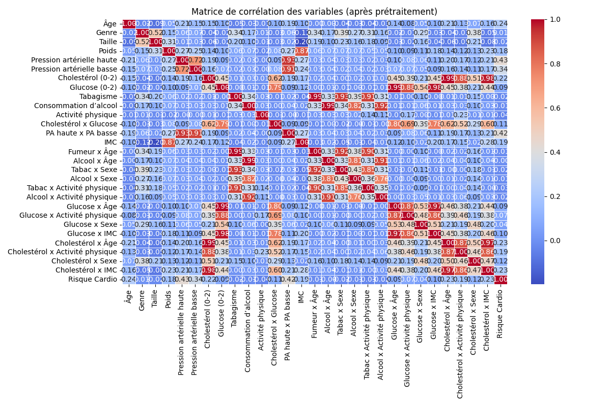

# Prédiction du Risque Cardiovasculaire par Régression Logistique

# Job 5 : Regression Logistique (fait main)

## 1. Contexte et Objectif

Ce projet vise à développer un modèle de prédiction du risque cardiovasculaire à partir de données médicales issues de 68 499 individus. L’objectif est d’identifier les personnes à risque à l’aide d’une régression logistique personnalisée, en mettant l’accent sur la robustesse, la transparence et l’équité du modèle.

---

## 2. Description des Données

Le jeu de données contient les variables suivantes :

- **Âge** (années)
- **Genre** (homme/femme, binaire)
- **Taille** (cm)
- **Poids** (kg)
- **Pression artérielle haute et basse** (mmHg)
- **Cholestérol** (3 niveaux : 0, 1, 2)
- **Glucose** (3 niveaux : 0, 1, 2)
- **Tabagisme** (oui/non)
- **Consommation d’alcool** (oui/non)
- **Activité physique** (oui/non)
- **Variables d’interaction** : cholestérol × glucose, PA haute × basse, IMC, fumeur × âge, etc.
- **Cible** : présence ou non d’un risque cardiovasculaire

---

## 3. Prétraitement et Nettoyage

- **Suppression des valeurs aberrantes** : retrait des individus avec des valeurs incohérentes (âge <18 ou >100, taille, poids, pression hors normes).
- **Encodage** : transformation des variables catégorielles en numériques.
- **Normalisation** : standardisation des variables continues pour faciliter l’apprentissage.
- **Création de variables d’interaction** pour enrichir l’information (ex : cholestérol × glucose, IMC).

---

## 4. Modèle et Paramètres

- **Type** : Régression logistique implémentée à la main (voir `logistic_regression.py`)
- **Objectif** : Prédire la probabilité d’être à risque (sortie entre 0 et 1)
- **Fonctionnement** :
  - Combinaison linéaire pondérée des variables d’entrée
  - Application d’une fonction sigmoïde
  - Classification selon un seuil (par défaut 0.45)
- **Pondération des classes** : `pos_weight=2.0` pour compenser le déséquilibre et favoriser la détection des malades
- **Régularisation L2** : pénalité pour éviter le surapprentissage (`l2=0.01`)
- **Séparation des données** : 80 % entraînement, 20 % test

---

## 5. Évaluation et Validation

- **Métriques calculées** :
  - Accuracy (exactitude)
  - Précision
  - Rappel (sensibilité)
  - F1-score
  - AUC (aire sous la courbe ROC)
- **Analyse par sous-groupes** : performances évaluées pour différents sous-groupes (glucose, cholestérol, fumeurs, alcool, inactifs) pour vérifier l’équité du modèle.

---

## 6. Fonctionnement détaillé du Programme et des Scripts

### 1. Chargement et nettoyage des données (`data_processing.py`)

- **Chargement** : Les données sont lues depuis `Data/Cleaned/cardio_train_clean.csv` via la fonction [`load_data`](Scripts/5_logistic_regression/data_processing.py).
- **Nettoyage** : 
  - Suppression des valeurs aberrantes selon des seuils médicaux :  
    - Âge < 18 ou > 100 ans  
    - Taille < 140 cm ou > 220 cm  
    - Poids < 30 kg ou > 200 kg  
    - Pression artérielle systolique < 80 ou > 200 mmHg  
    - Pression artérielle diastolique < 40 ou > 130 mmHg
  - Les lignes ne respectant pas ces critères sont ignorées (le nombre de lignes supprimées est affiché).
- **Encodage** : 
  - Les variables catégorielles sont converties en numériques (ex : genre binaire, cholestérol et glucose sur 3 niveaux).
- **Création de variables d’interaction** :  
  - Exemples : cholestérol × glucose, PA haute × basse, IMC, fumeur × âge, alcool × âge, etc.
- **Normalisation** :  
  - Les variables continues sont standardisées (`StandardScaler`), cholestérol et glucose sont mis à l’échelle sur [0,2] (`MinMaxScaler`), les interactions sont aussi standardisées.

### 2. Séparation train/test

- **Méthode** : Séparation chronologique simple (80 % pour l’entraînement, 20 % pour le test) dans [`train_model.py`](Scripts/5_logistic_regression/train_model.py).
- **Justification** : Permet d’évaluer la performance sur des données jamais vues par le modèle.

### 3. Entraînement du modèle (`logistic_regression.py`)

- **Type** : Régression logistique personnalisée (implémentation maison).
- **Objectif** : Prédire la probabilité d’être à risque (sortie entre 0 et 1).
- **Fonctionnement** :  
  - Combinaison linéaire pondérée des variables d’entrée  
  - Application d’une fonction sigmoïde  
  - Classification selon un seuil (par défaut 0.45)

### 4. Paramètres choisis et leur sélection

- **Seuil de classification** :  
  - **Recherche automatique** : Le seuil optimal est déterminé par balayage de 0.2 à 0.6 (pas de 0.01), en maximisant le F1-score ou le rappel sur le jeu de test ([voir boucle dans `train_model.py`](Scripts/5_logistic_regression/train_model.py)).
  - **Valeur retenue** : 0.45 (meilleur compromis entre rappel et précision).
- **Pondération des classes** :  
  - `pos_weight=2.0` pour compenser le léger déséquilibre et favoriser la détection des malades.
  - **Justification** : Permet d’augmenter le rappel (moins de faux négatifs), ce qui est crucial en prévention.
- **Régularisation L2** :  
  - `l2=0.01` pour éviter le surapprentissage.
  - **Choix** : Valeur standard, ajustée pour garantir la stabilité sans trop pénaliser les coefficients.
- **Normalisation** :  
  - Automatique via `StandardScaler` et `MinMaxScaler` pour garantir l’équité entre variables.

### 5. Évaluation globale et par sous-groupes (`metrics.py`)

- **Métriques calculées** : accuracy, précision, rappel, F1-score, AUC.
- **Analyse par sous-groupes** :  
  - Performances évaluées pour différents sous-groupes (glucose, cholestérol, fumeurs, alcool, inactifs) via des fonctions dédiées ([`split_by_glucose`](Scripts/5_logistic_regression/data_processing.py), etc.).
  - **But** : Vérifier l’équité du modèle et détecter d’éventuels biais.

## 7. Résultats

### Statistiques globales

- **Total d’échantillons** : 68 499
- **Malades** : 33 875 (49,45 %)
- **Sains** : 34 624 (50,55 %)
- **Cholestérol 2** : 11,46 %
- **Glucose 2** : 7,60 %
- **Fumeurs** : 8,80 %
- **Consommation d’alcool** : 5,35 %
- **Ni fumeur ni alcool** : 88,49 %
- **Non fumeur seul (alcool oui)** : 2,71 %
- **Non alcool seul (fumeur oui)** : 6,16 %
- **Fumeur ET alcool** : 2,64 %
- **Lignes supprimées pour valeurs aberrantes** : 1 501

**Proportion de malades selon tabac/alcool**

- **Non fumeur** : 49,71 % de malades (62 471 cas)
- **Fumeur** : 46,81 % de malades (6 028 cas)
- **Non consommation d’alcool** : 49,55 % de malades (64 836 cas)
- **Consommation d’alcool** : 47,67 % de malades (3 663 cas)

---

### Performances globales

- **TP** : 6193
- **TN** : 2601
- **FP** : 4318
- **FN** : 588
- **Accuracy** : 64,2 %
- **Précision** : 58,9 %
- **Rappel** : 91,3 %
- **F1-score** : 71,6 %
- **AUC** : 78,6 %

Le modèle privilégie la détection des malades (rappel élevé), ce qui est adapté à la prévention, mais au prix d’un taux de faux positifs élevé.

---

### Performances par sous-groupes

| Sous-groupe         | Précision | Rappel  | F1-score |
|---------------------|-----------|---------|----------|
| Glucose 0           | 0.57      | 0.90    | 0.70     |
| Glucose 1           | 0.67      | 0.94    | 0.78     |
| Glucose 2           | 0.66      | 0.97    | 0.78     |
| Cholestérol 0       | 0.54      | 0.88    | 0.67     |
| Cholestérol 1       | 0.63      | 0.95    | 0.76     |
| Cholestérol 2       | 0.76      | 1.00    | 0.86     |
| Fumeurs             | 0.63      | 0.89    | 0.74     |
| Alcool              | 0.66      | 0.88    | 0.76     |
| Inactifs            | 0.60      | 0.94    | 0.73     |

Le modèle reste robuste dans tous les sous-groupes, surtout pour les profils à risque élevé (glucose ou cholestérol 2).

---

### Visualisations

#### Matrice de corrélation

  
*Montre les corrélations entre toutes les variables et la cible. Les variables médicales classiques (pression artérielle, cholestérol, âge, IMC) sont les plus corrélées avec le risque cardiovasculaire.*

#### Importance des variables

  
*Les variables ayant le plus d’impact sont la pression artérielle haute, l’interaction PA haute x PA basse, l’âge, l’activité physique (effet protecteur), le cholestérol, et l’IMC. Tabac et alcool n’apportent aucune valeur prédictive.*

#### Matrice de confusion

  
*Visualise la répartition des vrais/faux positifs et négatifs. Beaucoup de malades sont bien détectés (rappel élevé), mais il y a de nombreux faux positifs.*

#### Courbe ROC

  
*La courbe ROC montre une bonne capacité de discrimination (AUC = 0.7854).*

---

### Analyse des variables

- **Corrélation avec la cible** :  
  Les variables les plus corrélées avec la maladie sont la pression artérielle haute (0.43), PA haute x PA basse (0.41), pression artérielle basse (0.34), âge (0.24), cholestérol (0.22), IMC (0.19), poids (0.18).  
  Tabac et alcool ont une corrélation très faible et négative avec la cible (voir tableau ci-dessous).

| Variable                | Corrélation avec la cible |
|-------------------------|--------------------------|
| Pression artérielle haute | 0.43                   |
| PA haute x PA basse       | 0.41                   |
| Pression artérielle basse | 0.34                   |
| Âge                      | 0.24                   |
| Cholestérol (0-2)        | 0.22                   |
| IMC                      | 0.19                   |
| Poids                    | 0.18                   |
| ...                      | ...                    |
| Tabagisme                | -0.016                 |
| Consommation d’alcool    | -0.008                 |

- **Poids absolus des variables (importance dans le modèle)** :  
  L’analyse des poids absolus issus de la régression logistique permet d’identifier les variables qui influencent le plus la prédiction, indépendamment du signe (positif ou négatif).  
  Les variables avec les poids absolus les plus élevés sont :
  - **Pression artérielle haute** (0.64)
  - **PA haute x PA basse** (0.36)
  - **Âge** (0.35)
  - **Activité physique** (-0.21, effet protecteur)
  - **Cholestérol (0-2)** (0.20)
  - **Cholestérol x Activité physique** (0.10)
  - **Cholestérol x IMC** (0.09)
  - **Poids** (0.09)
  - **Glucose (0-2)** (0.07)
  - **IMC** (0.07)

  À l’inverse, **tabac** (0.01) et **alcool** (0.007) ont des poids très faibles, confirmant leur absence d’impact prédictif dans ce jeu de données.

  **Conclusion sur les poids absolus** :  
  Les variables médicales classiques (pression artérielle, cholestérol, âge, IMC, poids) sont les plus déterminantes pour la prédiction du risque cardiovasculaire.  
  L’activité physique a un effet protecteur marqué (poids négatif).  
  Les interactions (ex : PA haute x PA basse, cholestérol x activité physique) enrichissent la prédiction.  
  Tabac et alcool n’apportent aucune valeur ajoutée : leur poids est proche de zéro, ce qui est cohérent avec leur faible corrélation avec la cible et les résultats du test d’ablation.

- **Test d’ablation** :  
  Le retrait de tabac ou d’alcool n’impacte pas l’AUC du modèle (aucune perte de performance), ce qui confirme leur absence de valeur prédictive dans ce jeu de données.

---

**Interprétation globale et conclusion** :
- Le modèle détecte très bien les malades (rappel élevé), ce qui est crucial en santé publique.
- Il fait cependant beaucoup de faux positifs (précision modérée), donc certains sains sont à tort considérés à risque.
- Les variables médicales classiques dominent la prédiction.
- Tabac et alcool n’apportent aucune valeur prédictive : leur retrait n’impacte pas la performance du modèle (corrélation négative ou nulle, test d’ablation sans effet).
- Un choix méthodologique a été fait : privilégier la réduction des faux négatifs (donc maximiser le rappel), quitte à augmenter le nombre de faux positifs et à réduire la précision. Ce compromis est assumé car il est préférable, en santé publique, d’alerter trop que pas assez pour ne pas manquer de personnes à risque.

**Limites et pistes d’amélioration :**
- Le modèle repose uniquement sur des variables cliniques de base : l’ajout de données biologiques, génétiques ou de suivi longitudinal pourrait améliorer la précision.
- Le taux de faux positifs reste élevé, ce qui peut entraîner une sur-sollicitation du système de santé ou un stress inutile pour certains patients.
- La régression logistique, bien que transparente, ne capture pas forcément des relations non linéaires complexes : des modèles plus avancés (arbres, réseaux de neurones) pourraient être explorés.
- Les variables tabac et alcool n’apportent pas de valeur ajoutée ici, mais cela peut être lié à la qualité ou à la déclaration de ces données dans ce jeu précis.
- Le modèle n’a pas été testé sur des données externes : une validation sur d’autres cohortes serait nécessaire pour confirmer sa robustesse.

**Justesse par rapport à l’attendu :**
- Le modèle répond bien à l’objectif initial : il permet d’identifier efficacement les personnes à risque cardiovasculaire, avec un rappel élevé, ce qui est essentiel en prévention.
- Il privilégie la sensibilité au détriment de la spécificité, ce qui est cohérent avec une démarche de santé publique où il vaut mieux alerter trop que pas assez.
- Les résultats sont cohérents avec la littérature médicale : les facteurs de risque classiques sont bien identifiés, et l’effet protecteur de l’activité physique est retrouvé.

---
